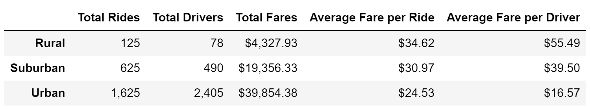
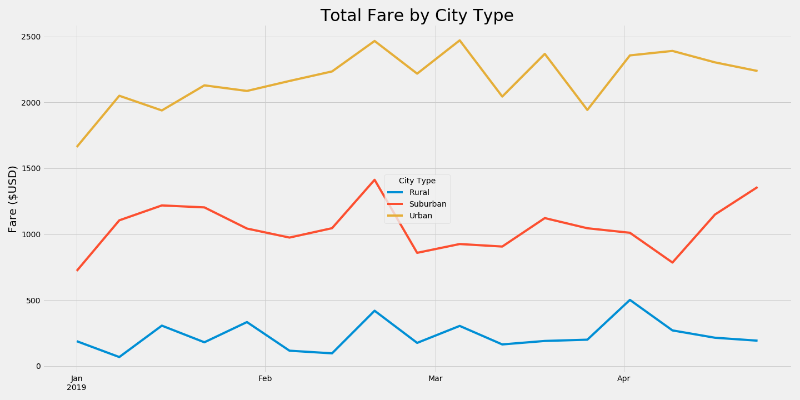

# Pyber_Analysis Challenge 5

An analysis was performed on PyBer ride sharing data to determine the allocation of revenue, drivers, and ride counts. The three categories were filtered by city types consisting of Suburban, Rural, and Urban. The comparison between the three city types allows PyBer to understand the business details of the different areas and ultimately make decisions to increase future profits. The table below contains the complete comparison showing the ride data, driver count, total fares, and the corresponding averages on a rider and driver basis. It is seen that the Urban city types see most of the traffic, and the Rural cities receiving the least amount of traffic. 

 
A few challenges were experienced throughout this assignment. Firstly, the data frames were merged incorrectly resulting in the driver_count data to be incorrectly summed. This was fixed by pulling the driver_count data directly from the city_data spreadsheet. Next, the date was formatted using a object datatype and in order to perform mathematical operations to the dates, this would have to be converted into a DateTime format. This was achieved using a pd.to_datetime function within Pandas. Finally, the formatting of the final summary graphs revealed a fair amount of troubles. In order to achieve the desired chart format, the xticks and xticks labels had to be modified. A for loop was built to take every even number (incld 0) index from the origina xticks()[0] array, and then the labels were modified by utilizing an list with the desired labels inside. 

As shown in the above figure, the majority of the fares received are from the Urban cities. However, when considering the values in the above table, the fare on a per rider and driver metric are higher for the Rural and Suburban cities. In order to maximize revenue, effort should be put into expanding the Rural and Suburban areas if saturation of drivers to riders isn't believed to be reached. Additional data for operating costs on a city type per rider and driver scale would also allow us to improve our analysis by adding a  cost for each city type. This would allow us to provide more information regarding the business operations on a city type scale. If a decision is made to expand the business in a certain area, we would reccomend that more frequent data collection and analysis be performed to monitor the impact that expansion has on the fares per rider and driver metrics. 
